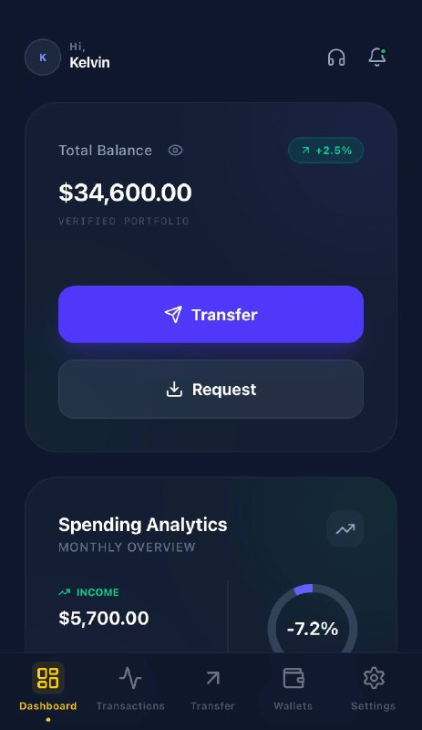
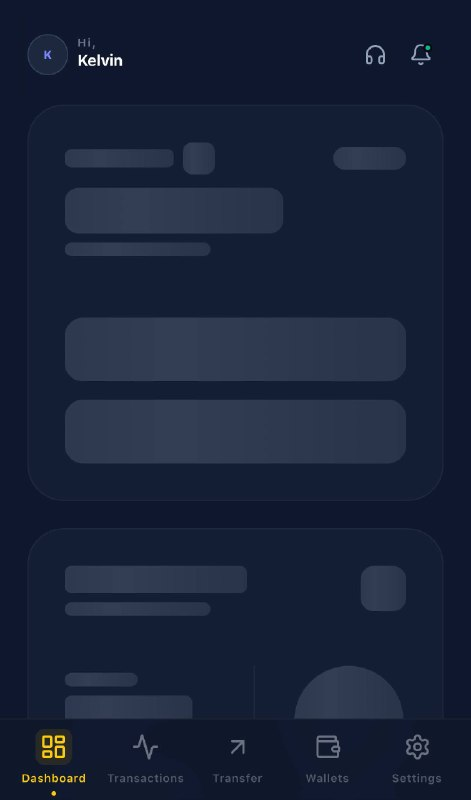

# 🏦 Trust Bank – Premium Fintech Dashboard

## 📱 Preview

<p align="center">
  
  
</p>

> **Note:** The UI features a fully responsive design with custom skeleton loaders to ensure a smooth user experience during data fetching.

<p align="center">
  
  
  
  
</p>

**Trust Bank** is a high-fidelity, full-stack banking application designed with a "Premium Dark" aesthetic. It features real-time spending analytics, a multi-step transfer flow, and a seamless user experience powered by a **React** frontend and a **FastAPI** backend.

---

## Key Features

- **Premium Dashboard:** A high-fidelity overview of account balances, interactive bank cards, and quick-action shortcuts.
- **Intelligent Analytics:** Visual breakdown of spending categories with monthly forecasts and a dynamic budget limit slider.
- **Multi-Step Transfers:** A structured 4-step transfer flow (Account -> Bank Selection -> Amount -> Success) with recent contact memory.
- **Zero-Jank UX:** Custom-engineered **Skeleton Loaders** for every route to ensure a smooth transition during API data fetching.
- **Responsive Architecture:** Fully optimized for mobile and desktop viewports using Tailwind CSS.
- **Secure Routing:** Centralized authentication guarding via a `ProtectedRoute` wrapper for all private banking data.

## Tech Stack

**Frontend:**

- **React 18** (Hooks, Context API, Memoization)
- **Tailwind CSS** (Custom 4xl radiuses, indigo-glassmorphism)
- **Lucide React** (Iconography)
- **React Router 6** (Nested Protected Routes)

**Backend:**

- **FastAPI** (Python)
- **JWT** (Secure Authentication)
- **Uvicorn** (ASGI Server)

---

## 📂 Project Structure

modern-bank-web-app/
├── backend/
│ ├── .vscode/
│ ├── auth/
│ ├── Data/
│ ├── helper/
│ ├── routes/
│ ├── venv/
│ ├── .env
│ ├── .env.example
│ ├── main.py
│ └── requirements.txt
└── frontend/
├── .vscode/
├── context/
├── node_modules/
├── public/
├── src/
├── .env.example
├── eslint.config.js
├── .gitignore
├── index.html
├── package.json
├── package-lock.json
├── vite.config.js
└── LICENSE
├── .gitignore
├── preview.png
└── README.md

## 🛠️ Installation & Setup

# 1. Clone the repository:

```bash
git clone [https://github.com/eugenekelvin24-debug/modern-bank-web-app](https://github.com/eugenekelvin24-debug/modern-bank-web-app)
cd modern-web-bank-app

# 2. Frontend Setup:
cd frontend
npm install
npm run dev

# 3. Backend Setup
cd backend
python3 -m venv venv
source venv/bin/activate  # Windows: venv\Scripts\activate
pip install -r requirements.txt
uvicorn main:app --reload

## 🔒 Environment Variables

Create a .env file in both the /frontend and /backend directories. Refer to .env.example for the required keys (API URLs, Secret Keys, etc.).

## 📝 License

Distributed under the MIT License. See LICENSE for more information.

Built with love and hardwork by Kelvin Eugene.

## 🧪 Demo Credentials
Explore the dashboard with:
* **Username:** admin@bank.com
* **Password:** 1234

## 🏗️ Architecture Flow
1. **Frontend:** React captures user credentials and sends a POST request to `/auth/login`.
2. **Backend:** FastAPI validates the user against `user.json` and generates a **JWT**.
3. **Storage:** The JWT is stored in `localStorage` (or Cookies) to persist the session.
4. **Data:** Subsequent requests include the Bearer Token to fetch private data from the `Data/` directory.
```
